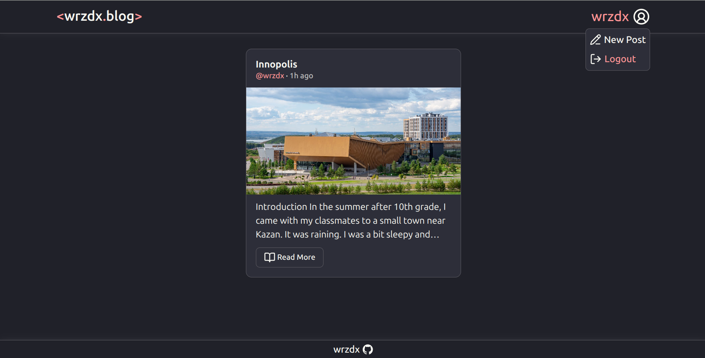

# Blog Platform

A full-stack blog application built with Express, Prisma, PostgreSQL, and React (Vite).

* **Live:** https://blog.wrzdx.tech

---

## Snapshots



---

## Key Features

* **Authentication**: Secure login and registration using JWT stored in HTTP-only cookies.
* **Post Management**: Create, edit, and delete blog posts.
* **Comments System**: Add and manage comments on posts.
* **Access Control**: Only authors can modify their own content.
* **Markdown Editor**: Rich text editing with MDX support.

---

## Additional Features

* **Image Uploads**: Upload and store images using Supabase Storage.
* **Error Handling**: Centralized backend error handling middleware.
* **Production Setup**: Deployed with Docker and Nginx under a single domain.
* **Security**: Cookie-based auth with SameSite and CSRF considerations.
* **Responsive UI**: Works across desktop and mobile devices.

---

## Tech Stack

### Backend

* Express.js
* Prisma
* PostgreSQL
* JWT Authentication

### Frontend

* React
* Vite
* React Router
* MDX Editor

---

## Architecture

```text
Client (browser)
        ↓
Nginx (reverse proxy)
        ↓
Frontend (React static build)
        ↓
/api → Express backend
        ↓
PostgreSQL + Supabase Storage
```

---

## Lessons Learned

* Handling authentication with cookies across domains is tricky — same-site architecture simplifies everything.
* Safari has stricter rules for cookies, which affects cross-site setups.
* Using Nginx as a reverse proxy removes the need for CORS entirely.
* Docker helps replicate production environments locally.

